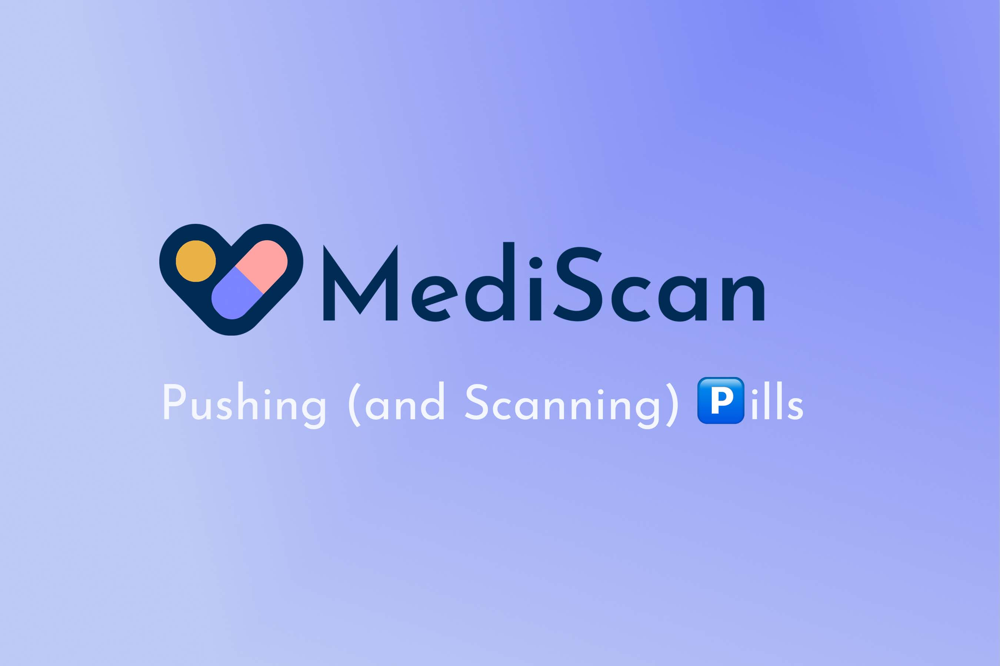
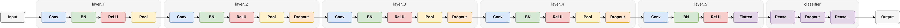
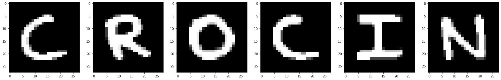
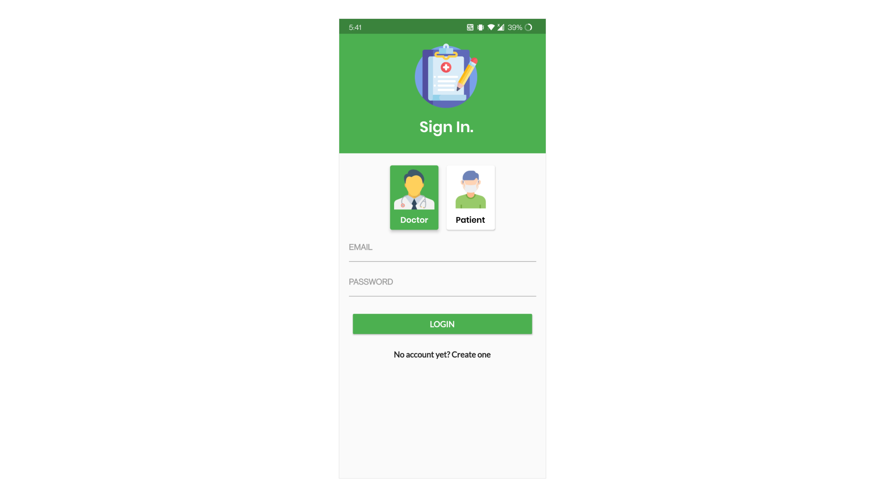
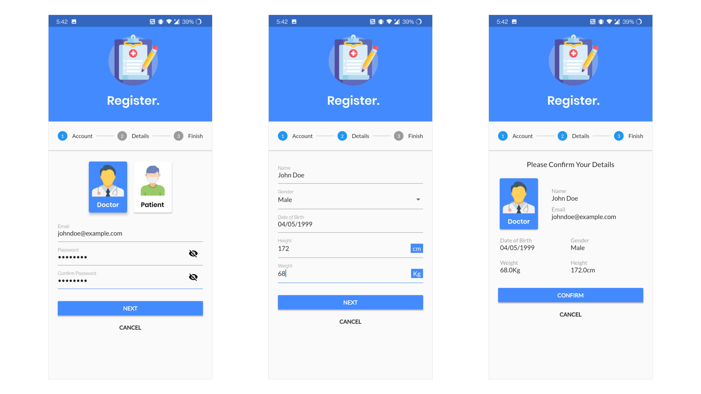
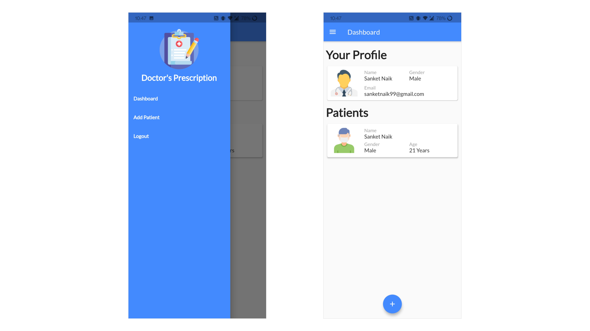
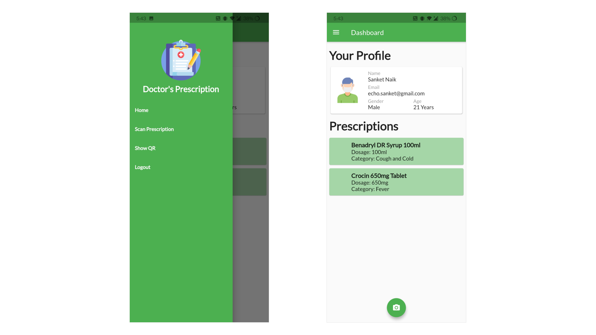
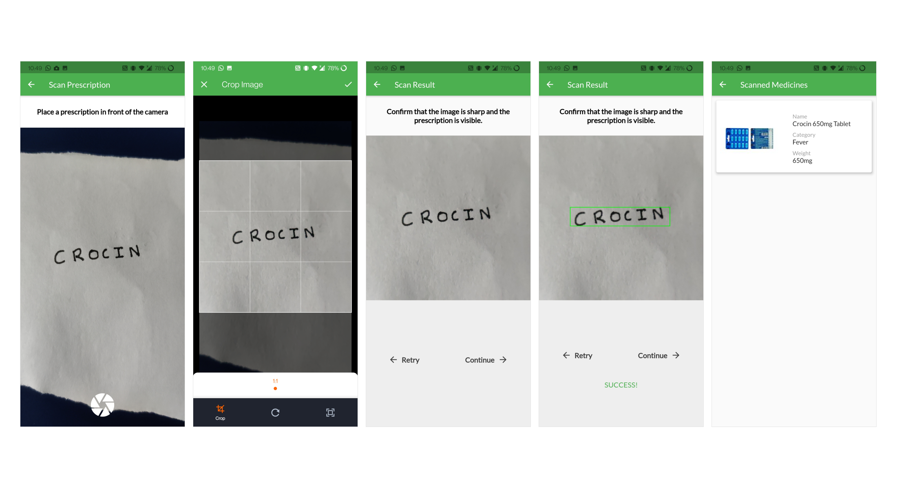
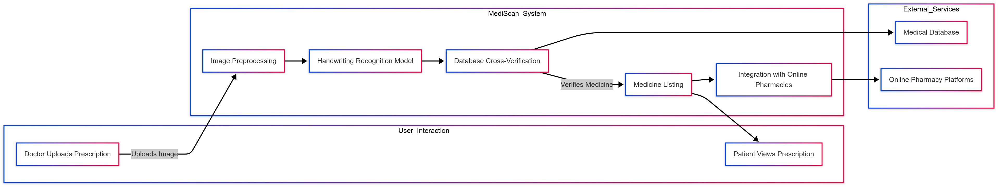

# 🏥 **MediScan – AI-Powered Doctor's Prescription System**  

  

🚀 **MediScan** is an innovative AI-driven system that utilizes **handwriting recognition** to extract medicine names from doctors' prescriptions with high accuracy. Built using **TensorFlow, Keras, and OpenCV**, this system enhances prescription management and ensures **error-free medication identification**.  

## 🔥 **Project Overview**  
The project consists of two major components:  
✅ **Handwriting Recognition Pipeline** – AI model for recognizing handwritten medicine names.  
✅ **Doctor's Prescription System App** – A mobile app for scanning, storing, and managing prescriptions.  

---

# 📑 **Contents**  

- [🧠 Handwriting Recognition Pipeline](#handwriting-recognition-pipeline)  
  - [🚀 Technologies Used](#technologies-used)  
  - [📊 Dataset](#dataset)  
  - [📈 Model Training](#model-training)  
  - [⚡ Deployment](#deployment)  
    - [🔍 Step 1: Image Preprocessing](#step-1-loading-and-resizing)  
    - [🎨 Step 2: Grayscale Conversion](#step-2-grayscale-conversion)  
    - [🔧 Step 3: Image Enhancement](#step-3-image-processing)  
    - [📏 Step 4: Thresholding for Better Recognition](#step-4-thresholding)  
    - [🖋️ Step 5: Contour Detection for Character Segmentation](#step-5-contour-detection)  
    - [✂️ Step 6: Cropping & Character Recognition](#step-6-cropping--character-recognition)  
    - [✅ Step 7: Output & Result](#step-7-result)  
- [📱 Android App](#android-app)  
  - [📌 Technologies Used](#technologies-used-1)  
  - [🔐 Sign In Page](#sign-in-page)  
  - [🆕 Sign Up Page](#sign-up-page)  
  - [👨‍⚕️ Doctor's Dashboard](#doctors-dashboard-page)  
  - [🏥 Patient's Dashboard](#patients-dashboard-page)  
  - [📄 Prescription Scanning](#prescription-scanning)  

---

# 🧠 **Handwriting Recognition Pipeline**  

The **Handwriting Recognition Pipeline** is the backbone of **MediScan**. This AI-powered system processes scanned prescriptions, extracts **handwritten medicine names**, and verifies them against a medicine database to prevent errors.  

## 🚀 **Technologies Used**  

| 🛠️ **Technology**  | 🌟 **Purpose & Benefits**  |  
|-------------------|-----------------------------------------------------------------|  
| **TensorFlow** 🤖 | A powerful deep-learning framework for training AI models.  |  
| **Keras** 🔬 | Simplifies deep learning model development with an intuitive API. |  
| **OpenCV** 📷 | Provides image processing tools for enhancing handwriting detection. |  
| **TensorFlow Lite** 📱 | Enables fast & efficient **on-device AI inference** in mobile apps. |  

---

## 📊 **Dataset – EMNIST for Handwritten Text Recognition**  

The AI model was trained using the **EMNIST dataset**, a large-scale dataset for **handwritten character recognition**.  

🔹 **Dataset Properties:**  
✅ **47 Character Classes** – Includes uppercase/lowercase letters & numbers.  
✅ **Image Size** – **28×28 grayscale images**.  
✅ **Training Images** – **112,800 samples**.  
✅ **Testing Images** – **18,800 samples**.  

🗂️ **Examples of Handwritten Characters:**  
  

---

## 📈 **Model Training – CNN for Handwritten Character Recognition**  

To achieve high accuracy, we developed a **multi-layer Convolutional Neural Network (CNN)** using **TensorFlow & Keras**. The model achieved **86% accuracy** after training for **20 epochs**.  

### 🏗️ **Model Architecture:**  

🔹 **Feature Extraction:**  
✅ **Conv2D Layers** – Extracts essential handwriting patterns.  
✅ **Batch Normalization** – Speeds up training & stabilizes learning.  
✅ **ReLU Activation** – Enhances non-linearity for better feature detection.  
✅ **MaxPooling2D** – Reduces dimensionality while preserving key details.  
✅ **Dropout Layers** – Prevents overfitting.  

🔹 **Classification & Output:**  
✅ **Flatten Layer** – Converts extracted features into a 1D vector.  
✅ **Dense Fully Connected Layer** – Learns to recognize character patterns.  
✅ **Softmax Output Layer** – Predicts the final character class.  

📌 **Visual Representation of Model Architecture:**  
  

--

# 🚀 **Deploying Handwriting Recognition in MediScan**  

MediScan brings **AI-powered handwritten prescription recognition** to your fingertips! The **TensorFlow Lite** model is seamlessly integrated into the app, ensuring **fast and accurate text extraction**. To achieve high-quality recognition, the image undergoes **a series of processing steps** before feeding it to the AI model.  

---

## 🔎 **Step-by-Step Handwriting Recognition Process**  

### 🖼️ **Step 1: Loading & Resizing the Image**  
The input image is loaded using OpenCV and resized to **300x300 pixels** to standardize input for the AI model.  

📌 **Why?**  
- Ensures consistent image size for processing  
- Optimizes model performance  

**Original Image:**  

  

---

### 🌑 **Step 2: Grayscale Conversion**  
The image is converted to **grayscale** using OpenCV’s `cvtColor` function.  

📌 **Why?**  
✔️ Enhances contrast between ink and paper  
✔️ Reduces noise for improved accuracy  

**Grayscale Image:**  

  

---

### 🎨 **Step 3: Image Processing & Enhancement**  
Several image processing techniques are applied to **boost contrast and isolate handwritten text** from the background.  

🛠️ **Techniques Used:**  
- **📉 absdiff:** Reduces noise by computing differences between original and blurred images.  
- **🎚️ normalize:** Adjusts pixel intensity for uniformity.  
- **📌 morphologyEx:** Uses **morphological transformations** to refine character edges.  
- **🔎 CLAHE:** Enhances contrast using **adaptive histogram equalization**.  

📌 **Why?**  
✔️ Removes unwanted shadows and noise  
✔️ Sharpens text for better recognition  

**Processed Image:**  

  

---

### ⚫⚪ **Step 4: Thresholding – Converting to Binary Format**  
Thresholding transforms the image into a **binary format** (black and white pixels).  

📌 **Why?**  
✔️ Clearly separates text from background  
✔️ Simplifies contour detection  

**Thresholded Image:**  

  

---

### 🏷️ **Step 5: Contour Detection**  
Contours are detected to identify **individual characters** in the image.  

📌 **Why?**  
✔️ Enables segmentation of handwritten text  
✔️ Helps in extracting character bounding boxes  

**Detected Contours (Character Boundaries):**  

  

---

### ✂️ **Step 6: Character Cropping & Ordering**  
Each detected **character is cropped** and arranged based on **x, y coordinates**.  

📌 **Why?**  
✔️ Prepares the text for AI-based recognition  
✔️ Maintains correct word structure  

**Cropped Characters:**  

  

---

### 🏆 **Step 7: AI-Based Character Recognition & Error Correction**  
Each extracted character is **fed into the TensorFlow Lite model** for recognition.  

🔍 **Final Processing Steps:**  
✔️ **Predict characters** using AI  
✔️ **Group characters** into words  
✔️ **Apply an error-matching algorithm** to fix misinterpretations (e.g., 'crocim' → 'crocin')  
✔️ **Fetch accurate medicine information** from the database  

🚀 **Final Output: The Correctly Recognized Prescription!**  

📌 **With MediScan, prescription errors are a thing of the past!** 🏥💊
# 📱 MediScan – Your Smart AI-Powered Healthcare Companion  

The **MediScan Android App** is designed to **revolutionize prescription management** with **AI-driven handwriting recognition**. Built using **Flutter**, the app offers a **smooth, intuitive, and secure** experience for both doctors and patients, ensuring **quick and accurate digitization of medical prescriptions**.  

💾 **Data Storage & Security**  
✔️ **User Information** securely stored in **Cloud Firestore**.  
✔️ **Scanned Prescriptions** uploaded and managed via **Firebase Storage**.  
✔️ **Seamless AI Model Integration** for real-time prescription analysis.  

---

## 🔥 Technologies Powering MediScan  

| 🚀 **Technology**    | 🌟 **Purpose & Benefits**  |
|-----------------|------------------------------------------------------------------------------------------------|
| **Flutter** 🛠️ | Google's open-source **UI toolkit** for building **beautiful, natively compiled apps** across Android, iOS, and more—**all from a single codebase**. |
| **Cloud Firestore** ☁️ | A **scalable and flexible NoSQL cloud database**, ensuring **real-time syncing** and seamless data management. |
| **Firebase Storage** 🔐 | Secure, **highly scalable storage** for handling scanned prescriptions **with fast retrieval**. |
| **TF Lite Android** 🤖 | **TensorFlow Lite** enables **on-device AI processing**, making the **handwriting recognition** model fast and efficient on mobile devices. |

🔹 **With MediScan, your prescriptions are just a scan away!** 📄✨
## 🌟 Sign In Page  

  

The **Sign In Page** provides a seamless and secure way for both **doctors and patients** to access the application. Users can choose their role (Doctor/Patient) and enter their credentials to log in. For new users, the **"Create Account"** button allows easy registration. The authentication system is powered by **Firebase Authentication**, ensuring a **safe and smooth login experience** with **email-password authentication and email validation**.  

---

## 🚀 Sign Up Page  

  

The **Sign Up Page** is designed for a smooth onboarding experience, guiding users through a **multi-step registration process**.  

🔹 **Step 1**: Select whether you're a **Doctor or a Patient** and enter your email and password.  
🔹 **Step 2**: Fill in personal details like **Name, Gender, Date of Birth, Height, and Weight**.  
🔹 **Step 3**: Review all the information entered before final submission.  

Once confirmed, a **verification email** is sent. After verifying, users can **log in and access all features effortlessly**.  

---

## 🏥 Doctor's Dashboard Page  

  

The **Doctor's Dashboard** is a centralized hub where doctors can **manage patients efficiently**.  

✨ **Key Features:**  
✔️ **View and manage patient information** in a structured layout.  
✔️ **Scan a patient’s QR Code** to instantly add them to the database.  
✔️ **Easy navigation** with a sidebar linking to the **Dashboard, Add Patient Page, and Logout button**.  

Designed for efficiency, this dashboard enhances workflow, making patient management **quick and hassle-free**.  

---

## 👩‍⚕️ Patient's Dashboard Page  

  

The **Patient's Dashboard** provides a **personalized** view of health records and prescriptions.  

🩺 **What’s Inside?**  
✔️ **Instant access** to personal health information.  
✔️ **View and manage prescriptions** assigned by doctors.  
✔️ **Scan new prescriptions** with a single tap.  
✔️ **Navigate effortlessly** to the **Dashboard, Prescription Scanner, QR Generator, and Logout button** using the sidebar.  

A user-friendly interface ensures **patients stay informed and in control of their healthcare journey**.  

---

## 📄 Prescription Scanning  

  

The **Prescription Scanning Feature** is the heart of the app, making **handwritten prescription recognition easy and accurate**.  

📌 **How it Works:**  
✅ Simply scan a **handwritten prescription** using the app.  
✅ Our **AI-powered recognition system** extracts text and verifies medicine names against a **medical database**.  
✅ **Instant access** to digitized prescriptions with all details.  
✅ **One-tap ordering**: If needed, users can be redirected to **top online pharmacies like PharmEasy, 1mg, Netmeds, and Apollo Pharmacy** to order medications effortlessly.  

With **MediScan**, managing prescriptions is no longer a hassle—it's **fast, reliable, and accessible anytime, anywhere**. 🚀💊

When a patient clicks on the scan prescription button or the action button on the patient dashboard, they are directed to the prescription scanning page. The scanning page shows the patient a camera preview. The patient can use this to capture an image of their prescription. Once the patient has captured an image of the prescription, a cropping screen is displayed which lets them crop the image to remove any background objects. When the patient is satisfied with the cropped image, they can click the done button. The patient is then shown a confirmation page where the image is displayed. The patient has to make sure that the image is sharp and the prescription is visible so that the recognition process is efficient and accurate. The patient can tap the retry button to click another image or tap the continue button to proceed with the recognition process.
When the patient taps the **Continue** button, the image is passed through the **handwriting recognition pipeline**, which extracts handwritten text from the prescription. The app then performs a **similarity detection check** against the **medicine database** to ensure accuracy and retrieve the exact medicine name. Once a match is found, the **medicine name and details** are displayed to the patient and stored in their **prescription database**. Additionally, if the patient wishes to order the prescribed medicines, they can choose to be redirected to leading online pharmacies such as **PharmEasy, 1mg, Netmeds, and Apollo Pharmacy** for seamless ordering.  

## Flow Diagram  
 