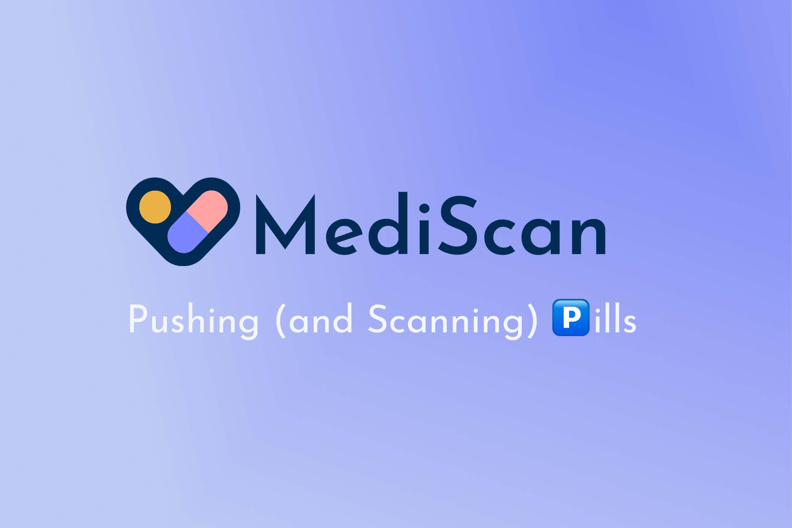
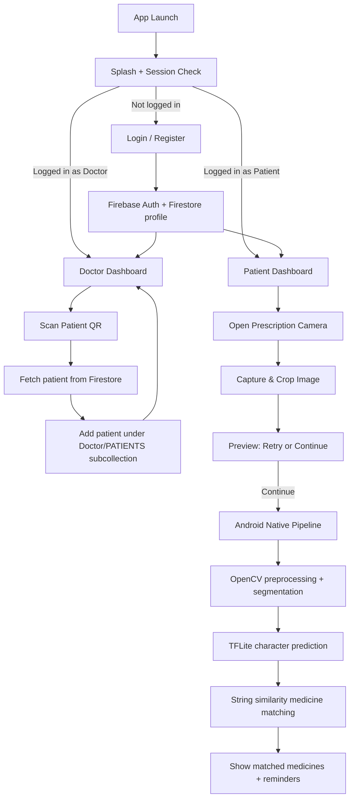
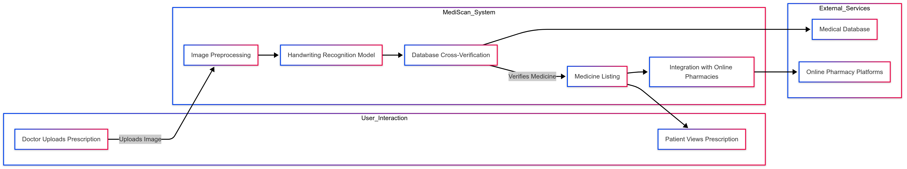
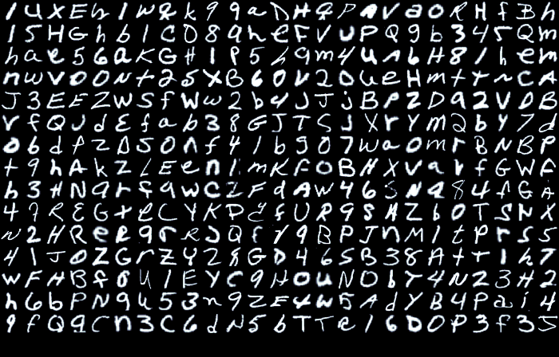
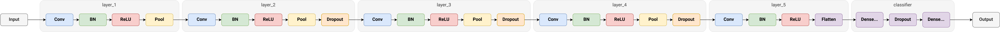
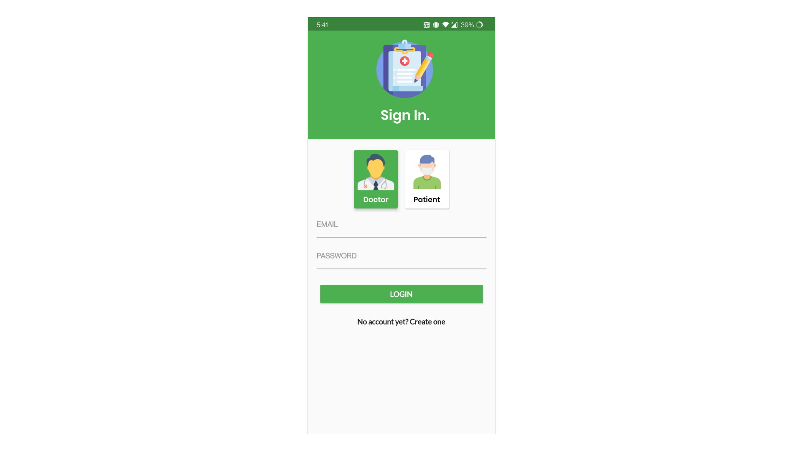
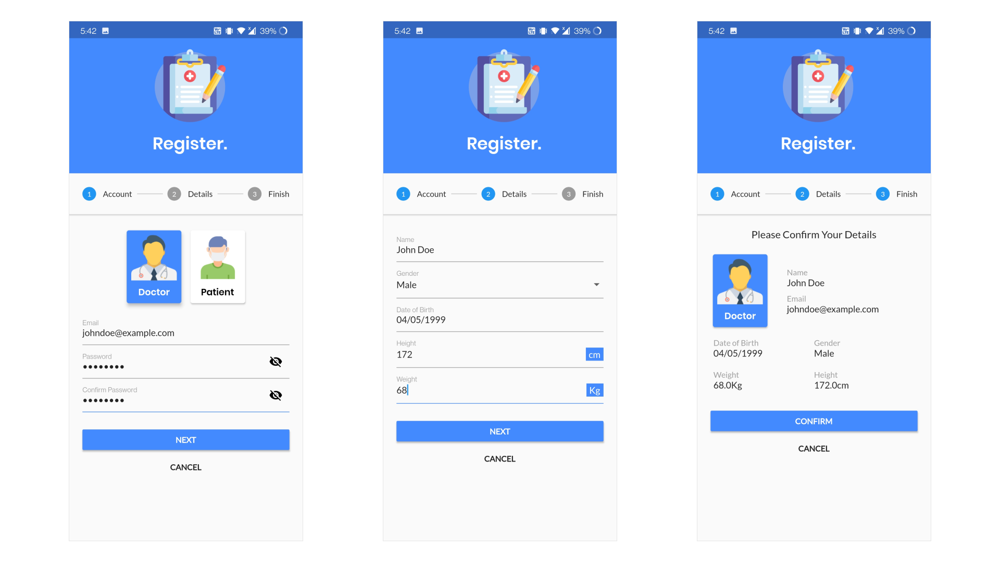
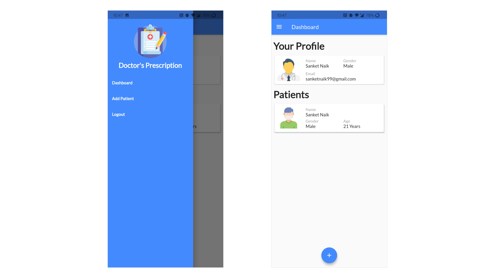
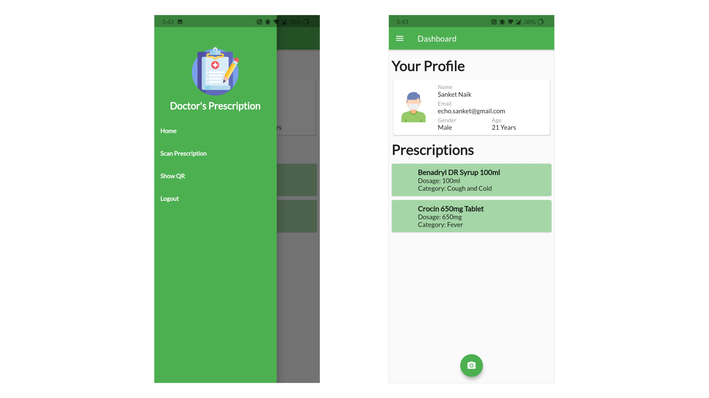
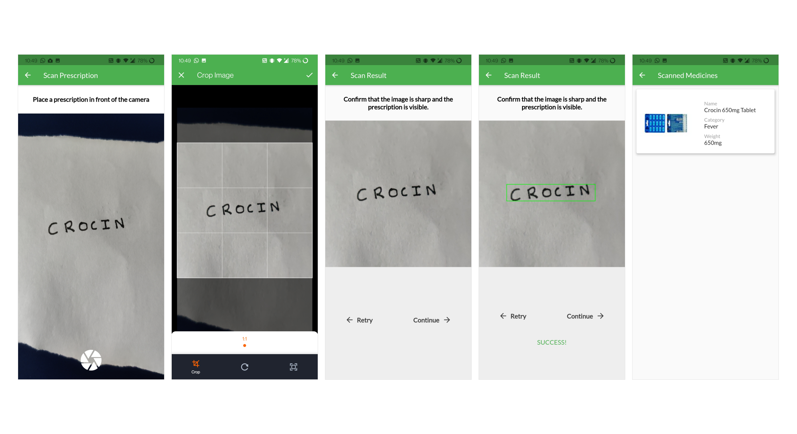

# MediScan



MediScan is a Flutter-based mobile app for digitizing handwritten prescriptions.  
It supports both **Doctor** and **Patient** workflows, uses **Firebase** for auth/data/storage, and runs an **OpenCV + TensorFlow Lite** handwriting pipeline on Android.

## Table of Contents

- [What this project does](#what-this-project-does)
- [Core features](#core-features)
- [End-to-end flow diagram](#end-to-end-flow-diagram)
- [Tech stack and why it is used](#tech-stack-and-why-it-is-used)
- [Handwriting pipeline (high level)](#handwriting-pipeline-high-level)
- [Screens](#screens)
- [Repository structure](#repository-structure)
- [Getting started](#getting-started)
- [Notes and limitations](#notes-and-limitations)

## What this project does

MediScan helps convert paper prescriptions into searchable digital medicine entries:

- Doctors can register/login and add patients by scanning patient QR codes.
- Patients can register/login, generate their QR, and scan prescriptions.
- Prescription images are processed, medicine text is predicted, and matched with medicine records.

## Core features

### Authentication and role-based access
- Email/password authentication using Firebase Auth.
- Role split: `Doctor` and `Patient`.
- Email verification flow and auto-login checks.

### Doctor workflow
- Doctor dashboard with profile and linked patient list.
- Add patient by scanning the patient QR code.
- Patient details preview before confirmation.

### Patient workflow
- Patient dashboard with profile and shortcuts.
- Generate personal QR code (doctor can scan this to connect).
- Capture prescription image using camera, crop, confirm, and process.
- View predicted/matched medicines and configure reminder details.

### Prescription intelligence
- Android native pipeline via Flutter `MethodChannel`.
- OpenCV preprocessing + contour-based segmentation.
- TensorFlow Lite model inference (`handwriting.tflite`).
- String-similarity based medicine matching against local cached medicine data.

## End-to-end flow diagram


```mermaid
flowchart TD
    A[App Launch] --> B[Splash + Session Check]
    B -->|Not logged in| C[Login / Register]
    B -->|Logged in as Doctor| D[Doctor Dashboard]
    B -->|Logged in as Patient| E[Patient Dashboard]

    C --> F[Firebase Auth + Firestore profile]
    F --> D
    F --> E

    D --> G[Scan Patient QR]
    G --> H[Fetch patient from Firestore]
    H --> I[Add patient under Doctor/PATIENTS subcollection]
    I --> D

    E --> J[Open Prescription Camera]
    J --> K[Capture & Crop Image]
    K --> L[Preview: Retry or Continue]
    L -->|Continue| M[Android Native Pipeline]
    M --> N[OpenCV preprocessing + segmentation]
    N --> O[TFLite character prediction]
    O --> P[String similarity medicine matching]
    P --> Q[Show matched medicines + reminders]
```

Legacy flow image:



## Tech stack and why it is used

| Technology | Where it is used | Why |
|---|---|---|
| Flutter (Dart) | App UI + navigation | Single mobile codebase for app screens and flows |
| Provider | State management (`AuthBloc`, `DoctorBloc`, `PatientBloc`) | Lightweight and simple reactive state handling |
| Firebase Auth | Login/signup/email verification | Managed authentication for Doctor/Patient users |
| Cloud Firestore | User profiles, doctor-patient links, medicines | Realtime NoSQL backend and flexible schema |
| Firebase Storage | Prescription image upload (legacy/alternate path) | Cloud storage for captured images |
| Camera + Image Cropper | Patient scan flow | Capture and clean prescription input before OCR |
| OpenCV (Android native) | Image preprocessing and contour extraction | Improves handwritten character extraction quality |
| TensorFlow Lite | On-device character inference | Fast local inference without heavy remote compute |
| Hive | Local medicine cache (`MedicinesBox`) | Quick local lookups during matching |
| String similarity | Prediction post-processing | Maps noisy OCR output to nearest medicine key |

## Handwriting pipeline (high level)

The Android native pipeline performs:

1. Load and resize image.
2. Convert to grayscale.
3. Apply filtering/normalization/morphology/CLAHE.
4. Threshold + contour detection.
5. Group and crop character regions.
6. Run TensorFlow Lite inference per character.
7. Assemble token predictions and match medicines.

Pipeline visuals:

- Input: 
- Grayscale: 
- Processed: 
- Threshold: 
- Contours: 
- Split chars: 

Model/character references:

- EMNIST character sample: 
- Model reference image: 

## Screens

| Screen | Preview |
|---|---|
| Sign In |  |
| Sign Up |  |
| Doctor Dashboard |  |
| Patient Dashboard |  |
| Prescription Scanning |  |

## Repository structure

```text
MediScan/
├── android/                  # Android runner + native OCR pipeline (Kotlin/OpenCV/TFLite)
├── ios/                      # iOS runner
├── lib/
│   ├── main.dart             # App entry + provider wiring + routes
│   ├── providers/            # Auth, doctor, patient business logic
│   ├── pages/                # UI pages (auth, dashboards, scanning, QR)
│   ├── models/               # Data models
│   └── components/           # Reusable UI widgets
├── assets/                   # App icons/animations
├── docs/                     # README images and flow assets
└── pubspec.yaml              # Dependencies and Flutter config
```

## Getting started

### 1) Prerequisites

- Flutter SDK (compatible with this older project setup)
- Android Studio / Android SDK
- A Firebase project
- A connected Android device or emulator

### 2) Install dependencies

```bash
flutter pub get
```

### 3) Configure Firebase

Set up Firebase for Android and place your `google-services.json` at:

```text
android/app/google-services.json
```

Enable:
- Authentication (Email/Password)
- Cloud Firestore
- Firebase Storage

### 4) Run the app

```bash
flutter run
```

## Notes and limitations

- This project uses older Flutter/Firebase package versions, so modern SDKs may require migration updates.
- Main OCR flow is currently Android native (`MethodChannel` + Kotlin pipeline).
- Internet connectivity is required for Firebase-backed features.
