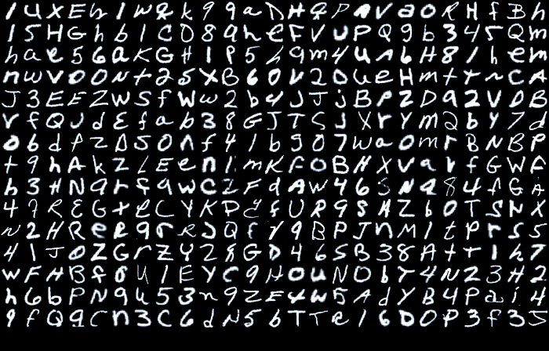

# 🏥 **MediScan – AI-Powered Doctor's Prescription System**  

  

🚀 **MediScan** is an innovative AI-driven system that utilizes **handwriting recognition** to extract medicine names from doctors' prescriptions with high accuracy. Built using **TensorFlow, Keras, and OpenCV**, this system enhances prescription management and ensures **error-free medication identification**.  

## 🔥 **Project Overview**  
The project consists of two major components:  
✅ **Handwriting Recognition Pipeline** – AI model for recognizing handwritten medicine names.  
✅ **Doctor's Prescription System App** – A mobile app for scanning, storing, and managing prescriptions.  

---

# 📑 **Contents**  

- [🧠 Handwriting Recognition Pipeline](#handwriting-recognition-pipeline)  
  - [🚀 Technologies Used](#technologies-used)  
  - [📊 Dataset](#dataset)  
  - [📈 Model Training](#model-training)  
  - [⚡ Deployment](#deployment)  
    - [🔍 Step 1: Image Preprocessing](#step-1-loading-and-resizing)  
    - [🎨 Step 2: Grayscale Conversion](#step-2-grayscale-conversion)  
    - [🔧 Step 3: Image Enhancement](#step-3-image-processing)  
    - [📏 Step 4: Thresholding for Better Recognition](#step-4-thresholding)  
    - [🖋️ Step 5: Contour Detection for Character Segmentation](#step-5-contour-detection)  
    - [✂️ Step 6: Cropping & Character Recognition](#step-6-cropping--character-recognition)  
    - [✅ Step 7: Output & Result](#step-7-result)  
- [📱 Android App](#android-app)  
  - [📌 Technologies Used](#technologies-used-1)  
  - [🔐 Sign In Page](#sign-in-page)  
  - [🆕 Sign Up Page](#sign-up-page)  
  - [👨‍⚕️ Doctor's Dashboard](#doctors-dashboard-page)  
  - [🏥 Patient's Dashboard](#patients-dashboard-page)  
  - [📄 Prescription Scanning](#prescription-scanning)  

---

# 🧠 **Handwriting Recognition Pipeline**  

The **Handwriting Recognition Pipeline** is the backbone of **MediScan**. This AI-powered system processes scanned prescriptions, extracts **handwritten medicine names**, and verifies them against a medicine database to prevent errors.  

## 🚀 **Technologies Used**  

| 🛠️ **Technology**  | 🌟 **Purpose & Benefits**  |  
|-------------------|-----------------------------------------------------------------|  
| **TensorFlow** 🤖 | A powerful deep-learning framework for training AI models.  |  
| **Keras** 🔬 | Simplifies deep learning model development with an intuitive API. |  
| **OpenCV** 📷 | Provides image processing tools for enhancing handwriting detection. |  
| **TensorFlow Lite** 📱 | Enables fast & efficient **on-device AI inference** in mobile apps. |  

---

## 📊 **Dataset – EMNIST for Handwritten Text Recognition**  

The AI model was trained using the **EMNIST dataset**, a large-scale dataset for **handwritten character recognition**.  

🔹 **Dataset Properties:**  
✅ **47 Character Classes** – Includes uppercase/lowercase letters & numbers.  
✅ **Image Size** – **28×28 grayscale images**.  
✅ **Training Images** – **112,800 samples**.  
✅ **Testing Images** – **18,800 samples**.  

🗂️ **Examples of Handwritten Characters:**  
  

---

## 📈 **Model Training – CNN for Handwritten Character Recognition**  

To achieve high accuracy, we developed a **multi-layer Convolutional Neural Network (CNN)** using **TensorFlow & Keras**. The model achieved **86% accuracy** after training for **20 epochs**.  

### 🏗️ **Model Architecture:**  

🔹 **Feature Extraction:**  
✅ **Conv2D Layers** – Extracts essential handwriting patterns.  
✅ **Batch Normalization** – Speeds up training & stabilizes learning.  
✅ **ReLU Activation** – Enhances non-linearity for better feature detection.  
✅ **MaxPooling2D** – Reduces dimensionality while preserving key details.  
✅ **Dropout Layers** – Prevents overfitting.  

🔹 **Classification & Output:**  
✅ **Flatten Layer** – Converts extracted features into a 1D vector.  
✅ **Dense Fully Connected Layer** – Learns to recognize character patterns.  
✅ **Softmax Output Layer** – Predicts the final character class.  

📌 **Visual Representation of Model Architecture:**  
  

--

# 🚀 **Deploying Handwriting Recognition in MediScan**  

MediScan brings **AI-powered handwritten prescription recognition** to your fingertips! The **TensorFlow Lite** model is seamlessly integrated into the app, ensuring **fast and accurate text extraction**. To achieve high-quality recognition, the image undergoes **a series of processing steps** before feeding it to the AI model.  

---

## 🔎 **Step-by-Step Handwriting Recognition Process**  

### 🖼️ **Step 1: Loading & Resizing the Image**  
The input image is loaded using OpenCV and resized to **300x300 pixels** to standardize input for the AI model.  

📌 **Why?**  
- Ensures consistent image size for processing  
- Optimizes model performance  

**Original Image:**  

  

---

### 🌑 **Step 2: Grayscale Conversion**  
The image is converted to **grayscale** using OpenCV’s `cvtColor` function.  

📌 **Why?**  
✔️ Enhances contrast between ink and paper  
✔️ Reduces noise for improved accuracy  

**Grayscale Image:**  

  

---

### 🎨 **Step 3: Image Processing & Enhancement**  
Several image processing techniques are applied to **boost contrast and isolate handwritten text** from the background.  

🛠️ **Techniques Used:**  
- **📉 absdiff:** Reduces noise by computing differences between original and blurred images.  
- **🎚️ normalize:** Adjusts pixel intensity for uniformity.  
- **📌 morphologyEx:** Uses **morphological transformations** to refine character edges.  
- **🔎 CLAHE:** Enhances contrast using **adaptive histogram equalization**.  

📌 **Why?**  
✔️ Removes unwanted shadows and noise  
✔️ Sharpens text for better recognition  

**Processed Image:**  

  

---

### ⚫⚪ **Step 4: Thresholding – Converting to Binary Format**  
Thresholding transforms the image into a **binary format** (black and white pixels).  

📌 **Why?**  
✔️ Clearly separates text from background  
✔️ Simplifies contour detection  

**Thresholded Image:**  

  

---

### 🏷️ **Step 5: Contour Detection**  
Contours are detected to identify **individual characters** in the image.  

📌 **Why?**  
✔️ Enables segmentation of handwritten text  
✔️ Helps in extracting character bounding boxes  

**Detected Contours (Character Boundaries):**  

  

---

### ✂️ **Step 6: Character Cropping & Ordering**  
Each detected **character is cropped** and arranged based on **x, y coordinates**.  

📌 **Why?**  
✔️ Prepares the text for AI-based recognition  
✔️ Maintains correct word structure  

**Cropped Characters:**  

  

---

### 🏆 **Step 7: AI-Based Character Recognition & Error Correction**  
Each extracted character is **fed into the TensorFlow Lite model** for recognition.  

🔍 **Final Processing Steps:**  
✔️ **Predict characters** using AI  
✔️ **Group characters** into words  
✔️ **Apply an error-matching algorithm** to fix misinterpretations (e.g., 'crocim' → 'crocin')  
✔️ **Fetch accurate medicine information** from the database  

🚀 **Final Output: The Correctly Recognized Prescription!**  

📌 **With MediScan, prescription errors are a thing of the past!** 🏥💊
# 📱 MediScan – Your Smart AI-Powered Healthcare Companion  

The **MediScan Android App** is designed to **revolutionize prescription management** with **AI-driven handwriting recognition**. Built using **Flutter**, the app offers a **smooth, intuitive, and secure** experience for both doctors and patients, ensuring **quick and accurate digitization of medical prescriptions**.  

💾 **Data Storage & Security**  
✔️ **User Information** securely stored in **Cloud Firestore**.  
✔️ **Scanned Prescriptions** uploaded and managed via **Firebase Storage**.  
✔️ **Seamless AI Model Integration** for real-time prescription analysis.  

---

## 🔥 Technologies Powering MediScan  

| 🚀 **Technology**    | 🌟 **Purpose & Benefits**  |
|-----------------|------------------------------------------------------------------------------------------------|
| **Flutter** 🛠️ | Google's open-source **UI toolkit** for building **beautiful, natively compiled apps** across Android, iOS, and more—**all from a single codebase**. |
| **Cloud Firestore** ☁️ | A **scalable and flexible NoSQL cloud database**, ensuring **real-time syncing** and seamless data management. |
| **Firebase Storage** 🔐 | Secure, **highly scalable storage** for handling scanned prescriptions **with fast retrieval**. |
| **TF Lite Android** 🤖 | **TensorFlow Lite** enables **on-device AI processing**, making the **handwriting recognition** model fast and efficient on mobile devices. |

🔹 **With MediScan, your prescriptions are just a scan away!** 📄✨
## 🌟 Sign In Page  

  

The **Sign In Page** provides a seamless and secure way for both **doctors and patients** to access the application. Users can choose their role (Doctor/Patient) and enter their credentials to log in. For new users, the **"Create Account"** button allows easy registration. The authentication system is powered by **Firebase Authentication**, ensuring a **safe and smooth login experience** with **email-password authentication and email validation**.  

---

## 🚀 Sign Up Page  

  

The **Sign Up Page** is designed for a smooth onboarding experience, guiding users through a **multi-step registration process**.  

🔹 **Step 1**: Select whether you're a **Doctor or a Patient** and enter your email and password.  
🔹 **Step 2**: Fill in personal details like **Name, Gender, Date of Birth, Height, and Weight**.  
🔹 **Step 3**: Review all the information entered before final submission.  

Once confirmed, a **verification email** is sent. After verifying, users can **log in and access all features effortlessly**.  

---

## 🏥 Doctor's Dashboard Page  

  

The **Doctor's Dashboard** is a centralized hub where doctors can **manage patients efficiently**.  

✨ **Key Features:**  
✔️ **View and manage patient information** in a structured layout.  
✔️ **Scan a patient’s QR Code** to instantly add them to the database.  
✔️ **Easy navigation** with a sidebar linking to the **Dashboard, Add Patient Page, and Logout button**.  

Designed for efficiency, this dashboard enhances workflow, making patient management **quick and hassle-free**.  

---

## 👩‍⚕️ Patient's Dashboard Page  

  

The **Patient's Dashboard** provides a **personalized** view of health records and prescriptions.  

🩺 **What’s Inside?**  
✔️ **Instant access** to personal health information.  
✔️ **View and manage prescriptions** assigned by doctors.  
✔️ **Scan new prescriptions** with a single tap.  
✔️ **Navigate effortlessly** to the **Dashboard, Prescription Scanner, QR Generator, and Logout button** using the sidebar.  

A user-friendly interface ensures **patients stay informed and in control of their healthcare journey**.  

---

## 📄 Prescription Scanning  

  

The **Prescription Scanning Feature** is the heart of the app, making **handwritten prescription recognition easy and accurate**.  

📌 **How it Works:**  
✅ Simply scan a **handwritten prescription** using the app.  
✅ Our **AI-powered recognition system** extracts text and verifies medicine names against a **medical database**.  
✅ **Instant access** to digitized prescriptions with all details.  
✅ **One-tap ordering**: If needed, users can be redirected to **top online pharmacies like PharmEasy, 1mg, Netmeds, and Apollo Pharmacy** to order medications effortlessly.  

With **MediScan**, managing prescriptions is no longer a hassle—it's **fast, reliable, and accessible anytime, anywhere**. 🚀💊

### 📸 **Prescription Scanning Process: From Capture to Convenience**  
# Flow Diagram  
 
When a patient taps the **Scan Prescription** button or the **action button** on the dashboard, they are seamlessly guided through an intuitive and efficient scanning process designed for accuracy and ease of use.  

#### 🏥 **Step 1: Capturing the Prescription**  
🔹 The patient is taken to a **camera preview screen**, where they can align their prescription and capture a clear image.  

#### ✂️ **Step 2: Cropping for Precision**  
🔹 A **cropping tool** appears, allowing the patient to remove unnecessary background details and focus only on the prescription.  
🔹 Once satisfied, they can tap **Done** to proceed.  

#### ✅ **Step 3: Confirmation & Verification**  
🔹 A **preview screen** displays the captured image, ensuring clarity for accurate recognition.  
🔹 The patient can either **Retry** for a better image or tap **Continue** to proceed.  

#### 🔍 **Step 4: AI-Powered Handwriting Recognition**  
🚀 The image is processed through the **advanced handwriting recognition pipeline**, extracting the handwritten medicine names with precision.  

#### 🏥 **Step 5: Smart Medicine Matching**  
🔹 The app **cross-checks** the extracted text against an extensive **medicine database**, ensuring accuracy and detecting the correct medicine names.  

#### 🛒 **Step 6: Instant Access & Online Ordering**  
✅ Matched **medicine names & details** are displayed on the screen.  
✅ The prescription is securely stored in the **patient’s database** for future reference.  
✅ Patients can seamlessly place an order with leading **online pharmacies** like **PharmEasy, 1mg, Netmeds, and Apollo Pharmacy** for hassle-free doorstep delivery.  

With this streamlined process, **getting prescriptions digitized and medicines delivered has never been easier!** 🚀
